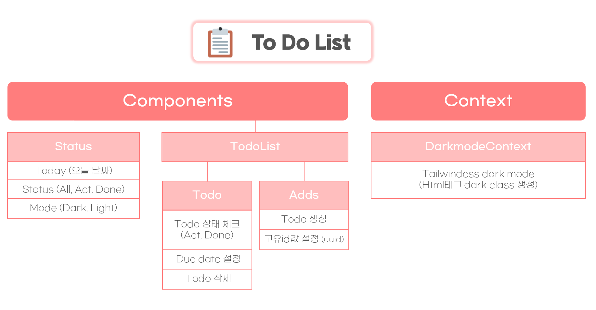
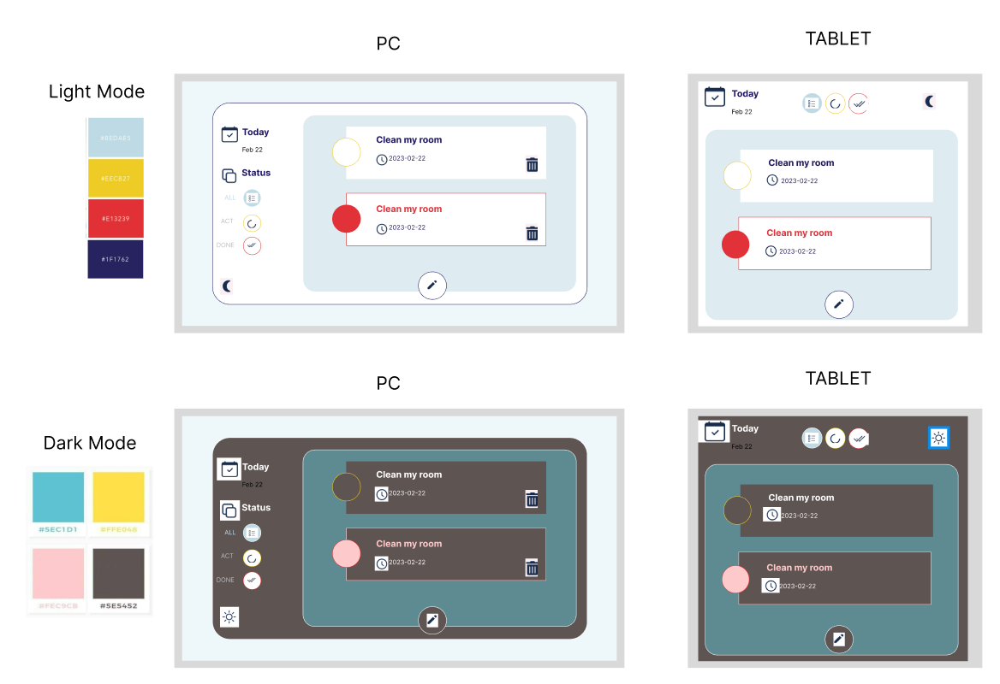
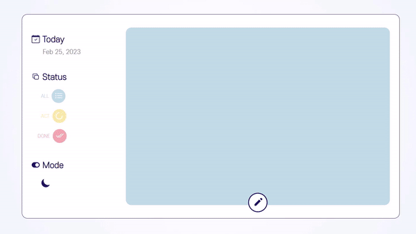
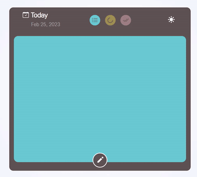

# 📝**Todo List**

[**Todo_List 배포**](https://hae-todolist.netlify.app/)

 

### 서비스 소개

 - 순수 React로 구현한 Todo List 프로젝트

 

### 서비스 제작 기간

- 2023-02-20 ~ 2023-02-25

 

## ⚙️ Stack

 

  
 

   

 

## 🖥️ IA설계

 

## Figma

 

## **화면 구성**

 

## PC Size

 

## Tablet Size

